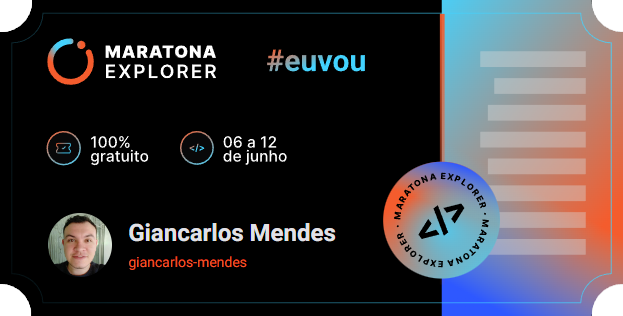

# Revele seu destino!🧙‍♂️

## 💻 Sobre o projeto
Digite sua pergunta no campo de texto, aperte o botão `Fazer pergunta` e releve o seu destino! 

🔮 Para revelar o seu destino [clique aqui](https://giancarlos-mendes.github.io/revele-seu-destino/)!

Projeto desenvolvido durante a **Maratona Explorer #1** oferecida pela [Rocketseat](https://evento.rocketseat.com.br/maratona-explorer/episodios/explorer/abertura/edicao/1). A Maratona Explorer é uma experiência online com muito conteúdo prático e dicas, onde é desenvolvida uma aplicação completa do zero durante uma semana.

***Ticket do evento:***

---

## ️🛠️ Tecnologias

As seguintes ferramentas foram utilizadas na contrução do projeto:

**Linguagens:**

-   

**Editor:**
- 

---

## 👨‍💻 Autor

**Giancarlos Mendes**

---
